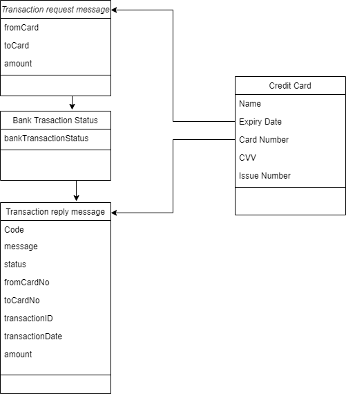
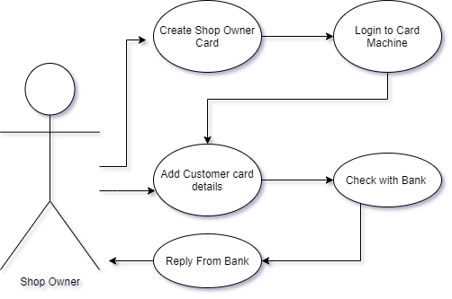
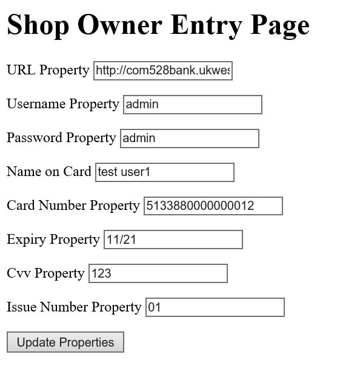
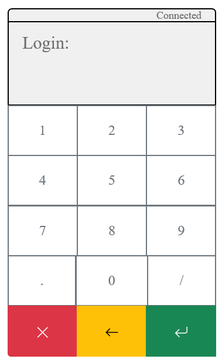

# Design
### Introduction
This doccument is intended as a reference to the design of the credit card reader application. Below are diagrams of the classes that are to be implemented along with the robustness diagram and user interface design.

## Class Diagram

## Robustness Diagram

## UI design

